# Hello There, my name is Gershon (or Garry in short)👋

Google-certified Cloud Engineer based in Israel, with about 3 years of experience working with GCP (Compute Engine, VPC, IAM, Kubernetes) and supporting enterprise customers at scale.
Currently transitioning into sysadmin, IT infrastructure, and cloud operations, while also exploring cybersecurity on the side.

---

## What I work with

| Area | Tools |
|------|-------|
| ☁️ Cloud | GCP, gcloud CLI, Cloud Logging, Google Workspace Admin |
| 🌐 Networking | TCP/IP, DNS, VPN, firewall rules, VPC |
| 🖥️ OS | Linux (Ubuntu, CentOS), Windows 10/11 |
| 🔐 Learning | Active Directory, Windows Server, cybersecurity (TryHackMe), Python |

---

## Tech Stack

**Tools & Infrastructure**

**Languages**

**Operating Systems & Editors**

---

## Certifications

- 🏅 **Google Associate Cloud Engineer** (2024–2027)
- 🛡️ **TryHackMe** — cybersecurity & sysadmin labs (ongoing)
- 🐍 **Python Basics** — Codecademy (ongoing)

---

## Projects

- 🎮 **[Job Tracker](https://github.com/shawramaland/jobtracking)** — built while job hunting. Tracks applications, preps for interviews, and has arcade games for the waiting. Dockerized.

---

## Background

Ex-Israel Air Force — Helicopter Mechanic and Rescue Team Leader.  
Learned to stay calm when things break under pressure. Still applies.

---

## Frontline — Contribution Grid

> Every contribution is an operation. Every streak is a mission complete.

---

*Open to sysadmin, IT infrastructure, or cloud operations roles.*
